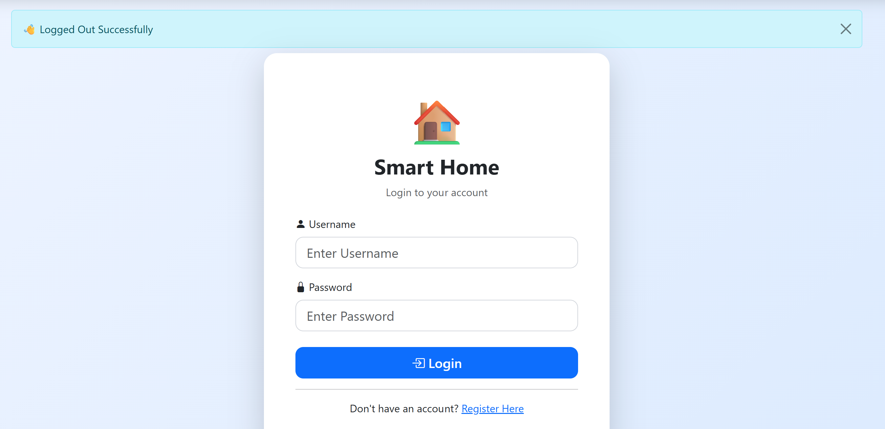
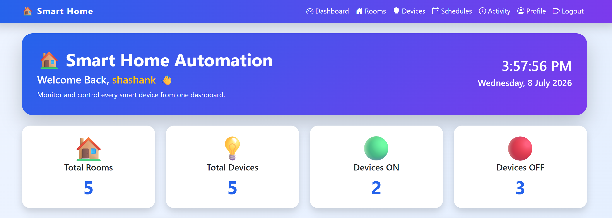
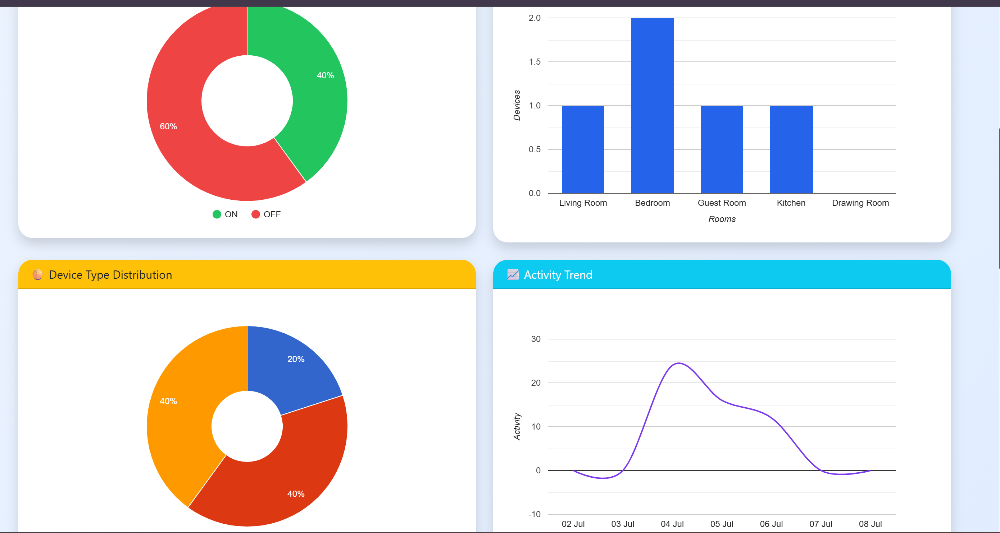
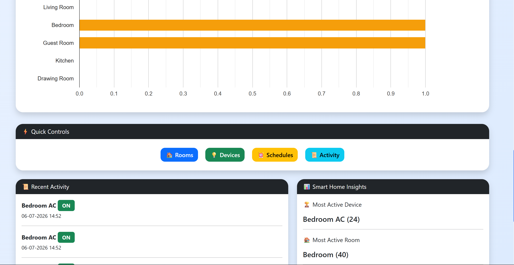
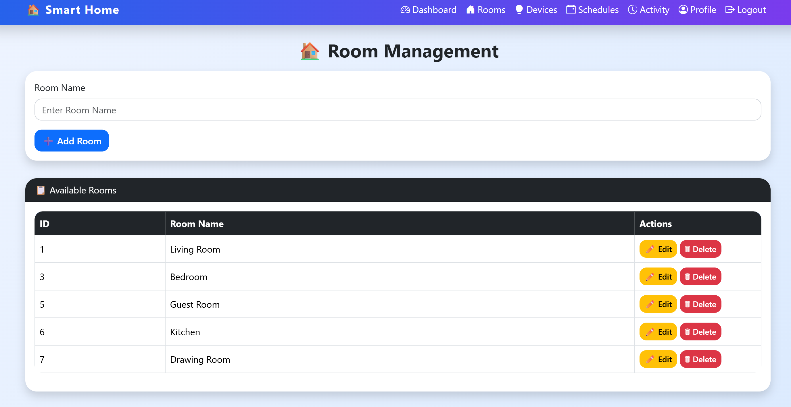
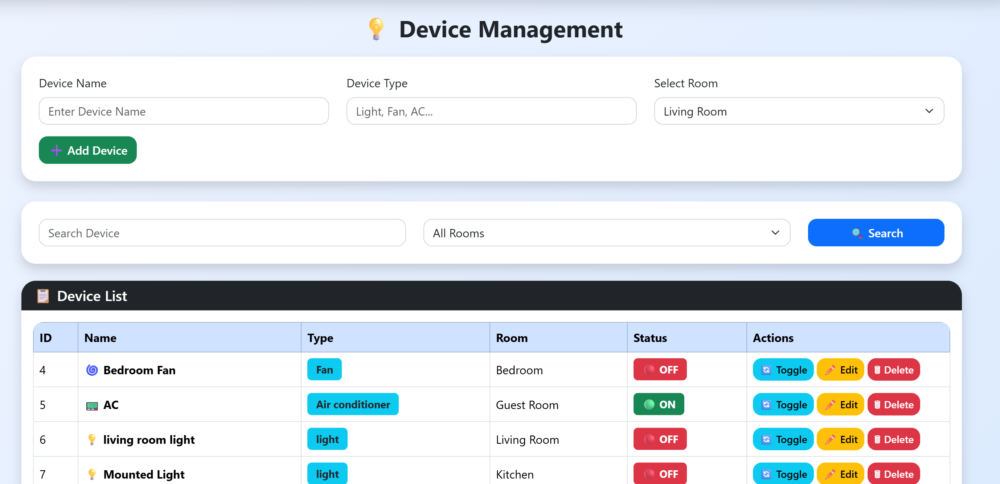
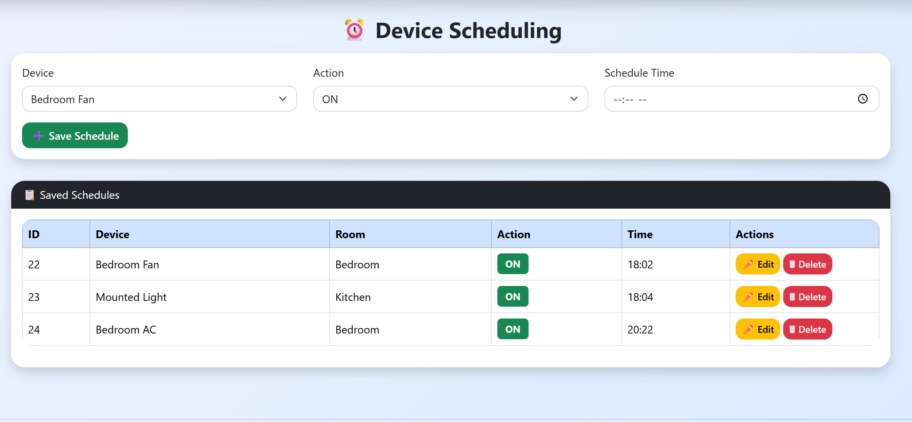
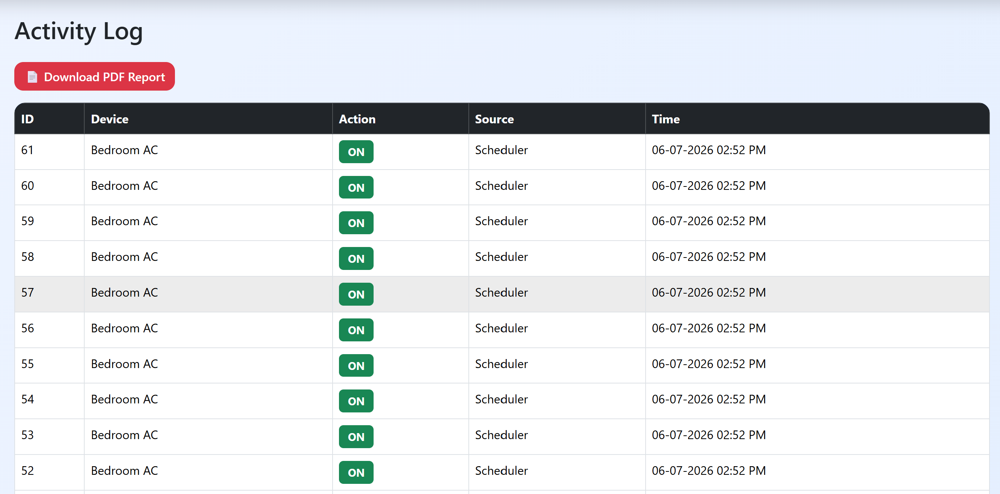
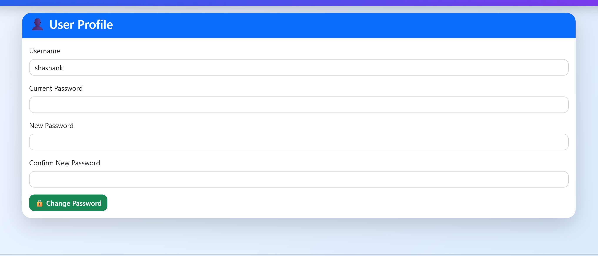

# 🏠 Smart Home Automation System


A Smart Home Automation web application built with **Flask**,
**SQLAlchemy**, **MySQL/Neon**, **Bootstrap**, and **Google Charts**.

## ✨ Features

-   User Registration & Login
-   Secure Password Hashing
-   Dashboard with Analytics
-   Room Management (CRUD)
-   Device Management (CRUD)
-   Device ON/OFF Control
-   Schedule Management
-   Activity Logs
-   PDF & CSV Export
-   Profile & Password Change
-   Responsive UI
-   Dark Mode
-   Render Deployment
-   Neon Database Support

## 🛠 Tech Stack

**Frontend** - HTML5 - CSS3 - Bootstrap 5 - JavaScript - Google Charts

**Backend** - Python - Flask - SQLAlchemy

**Database** - MySQL - Neon PostgreSQL (deployment)

## 📂 Project Structure

``` text
SmartHomeAutomation/
│── app.py
│── config/
│── database/
│── routes/
│── services/
│── scheduler.py
│── templates/
│── static/
│── screenshots/
│── requirements.txt
└── README.md
```

## 🚀 Installation

``` bash
git clone https://github.com/shank43/SmartHomeAutomation.git
cd SmartHomeAutomation
python -m venv venv
venv\Scripts\activate
pip install -r requirements.txt
python app.py
```

Open: http://127.0.0.1:5000

## 🌐 Live Demo

https://smarthomeautomation-72o7.onrender.com

## 💻 GitHub Repository

https://github.com/shank43/SmartHomeAutomation

## 📸 Screenshots

> Place these files inside the `screenshots` folder.

### Login



### Dashboard





### Rooms



### Devices



### Schedules



### Activity



### Profile



## 🔒 Security

-   Password hashing
-   Session authentication
-   Protected routes

## 🔮 Future Scope

-   IoT Integration
-   Voice Assistant
-   Email Notifications
-   Mobile App
-   MQTT Support

## 📄 License

This project is for educational purposes.
